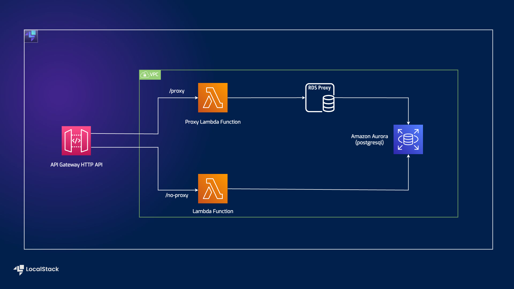

# Serverless RDS Proxy Demo

| Key          | Value                                                                |
| ------------ | -------------------------------------------------------------------- |
| Environment  |  |
| Services     | API gateway, RDS Proxy, Lambda, Amazon Aurora                                    |
| Integrations | Serverless Framework, SAM, AWS SDK, Cloudformation     |
| Categories   | Serverless, Lambda Functions, Load Testing |
| Level        | Intermediate                                                         |
| Github       | [Repository link](https://github.com/localstack/sample-serverless-rds-proxy-demo) |     


# Introduction

This project demos benefits of using RDS proxy with serverless workload which depends on relational database like RDS Aurora.
Project shows end to end automated setup of RDS Aurora(PostgreSQL) with RDS proxy. Basic serverless architecture is set up 
using API gateway HTTP API and Lambda Functions.

Project sets up two endpoints with HTTP API, one which talks directly to RDS Aurora cluster and the other which talks 
via RDS Proxy. It provides load testing setup to measure the benefits of using RDS proxy in terms of connection pooling 
and elasticity.

This project assumes you already have RDS Aurora PostgreSQL cluster up and running. An RDS proxy instance
is also setup with force IAM authentication enabled. You can choose to create rds cluster with proxy following 
steps [below](#deploy-rds-aurora-cluster-with-rds-proxy) to have aurora cluster and 
RDS proxy setup.

## Architecture

The following diagram shows the architecture that this sample application builds and deploys:



## Prerequisites

* LocalStack Pro with the [`localstack` CLI](https://docs.localstack.cloud/getting-started/installation/#localstack-cli).
* [Serverless Application Model](https://docs.localstack.cloud/user-guide/integrations/aws-sam/) with the [samlocal](https://github.com/localstack/aws-sam-cli-local) installed.
* [Python 3.9 installed](https://www.python.org/downloads/).
* [Artillery](https://artillery.io/docs/guides/overview/welcome.html) for load testing of the application.

Start LocalStack Pro with the `LOCALSTACK_API_KEY` pre-configured:

```shell
export LOCALSTACK_API_KEY=<your-api-key>
localstack start
```

> If you prefer running LocalStack in detached mode, you can add the `-d` flag to the `localstack start` command, and use Docker Desktop to view the logs.

## Instructions

You can build and deploy the sample application on LocalStack by running our `Makefile` commands. Run `make deploy` to create the infrastructure on LocalStack. Run `make stop` to delete the infrastructure by stopping LocalStack.

Alternatively, here are instructions to deploy it manually step-by-step.

### Deploy RDS Aurora Cluster with RDS Proxy

**Note:** If you have already provisioned RDS Aurora cluster with RDS Proxy, you can skip 
this step and follow [these steps](#deploy-serverless-workload-using-rds-aurora-as-backend) instead.

This stack will take care of provisioning RDS Aurora PostgreSQL along with RDS proxy fronting it inside
a VPC with 3 private subnet. Required parameters needed by [next step](#deploy-serverless-workload-using-rds-aurora-as-backend)
is also provided as stack output.

```bash
    samlocal build -t rds-with-proxy.yaml --use-container
    samlocal deploy -t rds-with-proxy.yaml --guided
```
### Deploy serverless workload using RDS Aurora as backend

To build and deploy your application for the first time, run the following in your shell:
Pass required parameters during guided deploy.

```bash
    samlocal build --use-container
    samlocal deploy --guided
```

### Installing artillery

We will use [artillery](https://artillery.io/docs/guides/overview/welcome.html) to generate some load towards both the apis. 
Install Artillery via npm:

```
    npm install -g artillery@latest
```

## Load testing

### Checking your installation

If you used npm to install Artillery globally, run the following command in your preferred command line interface:

```
    artillery dino
```

You should see an ASCII dinosaur printed to the terminal. Something like this:


### Testing the application

Before starting load testing, make sure `target` in files `load-no-proxy.yml` and  `load-proxy.yml` is update with the 
created HTTP API endpoint. The endpoint is also provided as stack output `ApiBasePath` when 
executing [above steps](#deploy-serverless-workload-using-rds-aurora-as-backend). You can generate load on both the APIs via:

```
    artillery run load-no-proxy.yml
```

```
    artillery run load-proxy.yml
``` 

## Security

See [CONTRIBUTING](CONTRIBUTING.md#security-issue-notifications) for more information.

## License

This library is licensed under the MIT-0 License. See the LICENSE file.